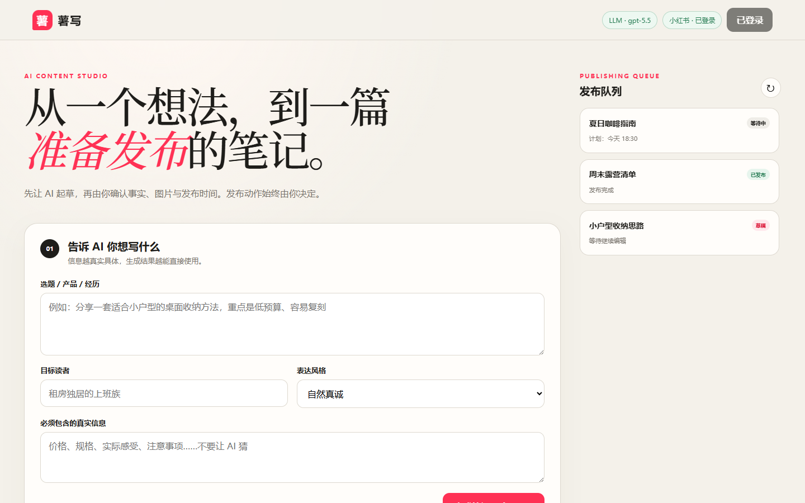

# 薯写：小红书 AI 内容发布台

运行在你自己电脑上的小红书图文笔记生成、预览、扫码登录与定时发布工具。账号会话、图片和任务文件都保存在本机；不会收集手机号或密码，也不会绕过验证码和平台风控。



## 项目亮点

| 能力 | 说明 |
| --- | --- |
| AI 笔记草稿 | 根据选题、目标读者、表达风格和真实信息生成标题、正文、标签与图片搜索词 |
| 自动找图 | 通过 Openverse 搜索并下载 CC0/公共领域图片，同时保留来源信息 |
| 扫码登录 | 在本地控制台显示小红书官方二维码，登录会话只保存在本机浏览器配置中 |
| 发布队列 | 支持草稿、立即发布、定时发布、取消、删除和安全重试 |
| Playwright 自动化 | 自动填写图片、标题与正文，并对发布结果进行确认，避免不确定状态下重复发布 |
| 本地优先 | 服务仅监听 `127.0.0.1`，API Key、Cookie、图片和正式任务默认不进入 Git |

## 工作流程

1. 输入选题、受众、风格和必须包含的真实信息。
2. 使用 LLM 生成草稿，并由用户核对、修改。
3. 自动搜索公共版权图片，或手动添加自己的素材。
4. 扫码登录小红书创作服务平台，保存本机会话。
5. 保存草稿、立即发布，或加入定时发布队列。

## 推荐：使用网页控制台

需要 Node.js 20 或更高版本。首次运行：

```powershell
npm install
npx playwright install --no-shell chromium
Copy-Item config.example.json config.json
Copy-Item .env.example .env
```

编辑 `.env`，填写 OpenAI API 密钥：

```dotenv
OPENAI_API_KEY=你的密钥
OPENAI_MODEL=gpt-5.6-luna
```

启动：

```powershell
npm run web
```

访问 `http://127.0.0.1:3210`。网页服务只监听本机，不会暴露到局域网。

网页中可以：

- 点击“扫码登录”，直接在控制台弹窗中扫描小红书官方二维码；不再打开额外浏览器窗口。扫码成功后自动保存本机会话。
- 输入选题、读者、风格与真实信息，让 LLM 生成标题、正文、标签和图片搜索词。
- 自动从 Openverse 搜索并下载 3 张 CC0/公共领域竖图，也可换一批或手动替换。
- 编辑并核对 AI 草稿，上传 1–18 张 JPG、PNG 或 WebP 图片。
- 保存草稿、立即发布或设置定时发布。
- 查看任务的等待、发布中、成功、失败和需要人工处理状态。
- 对等待中的任务执行“取消发布”；已取消、草稿或失败任务可从队列永久删除。

API 密钥只由本机 Node.js 服务读取，不会返回给浏览器或写入任务文件。模型调用使用 Responses API 结构化输出，并设置 `store: false`。默认模型可用 `OPENAI_MODEL` 替换；自定义兼容网关可设置 `OPENAI_BASE_URL`。

> AI 生成的是草稿。正式发布前请核对事实、广告合规、图片版权和平台规则。

自动找图使用 Openverse 匿名 API，只请求标记为 CC0 或公共领域（PDM）的图片，并在页面和任务中保留来源信息。开放图库的许可证元数据也可能出错，正式发布前仍应打开来源页面核对。

## 命令行方式

### 扫码登录

```powershell
npm run login
```

会话保存在 `data/browser-profile/`，不要提交到 Git 或发送给他人。

### 任务格式

复制 `posts/example.json`，把状态改为 `pending`，并替换图片路径：

```json
{
  "id": "2026-08-14-coffee",
  "status": "pending",
  "publishAt": "2026-08-14T20:00:00+08:00",
  "title": "在家做冰拿铁",
  "content": "今天试了一个很稳定的比例……",
  "images": ["../assets/coffee-1.jpg", "../assets/coffee-2.jpg"],
  "tags": ["咖啡", "自制饮品"]
}
```

### 演练与发布

```powershell
node src/cli.js validate posts/你的任务.json
node src/cli.js publish posts/你的任务.json --dry-run
node src/cli.js publish posts/你的任务.json
```

演练会填写发布页面并截图，但不会点击“发布”。截图位于 `data/artifacts/`。

持续监听定时任务：

```powershell
npm run daemon
```

只扫描一次：

```powershell
node src/cli.js daemon --once
```

## 任务状态

- `draft`：草稿，发布器忽略。
- `pending`：等待发布时间。
- `publishing`：正在操作发布页面。
- `published`：页面已返回成功结果。
- `failed`：本地文件、校验或浏览器发生明确错误。
- `needs_attention`：登录失效，或点击发布后无法确认结果。为防止重复发布，工具不会自动重试。
- `cancelled`：用户已取消发布计划，文案与图片仍保留，可随后删除。

## 安全边界

- 服务固定监听 `127.0.0.1`，并拒绝来自其他站点的写入请求。
- `.env`、登录会话、上传图片和正式任务默认被 Git 忽略。
- 不绕过验证码、风控或账号权限；平台要求验证时需要人工完成。
- 登录会话相当于凭据，请保护 `data/browser-profile/`。
- 页面改版后先使用 `--dry-run`，再恢复自动发布。
